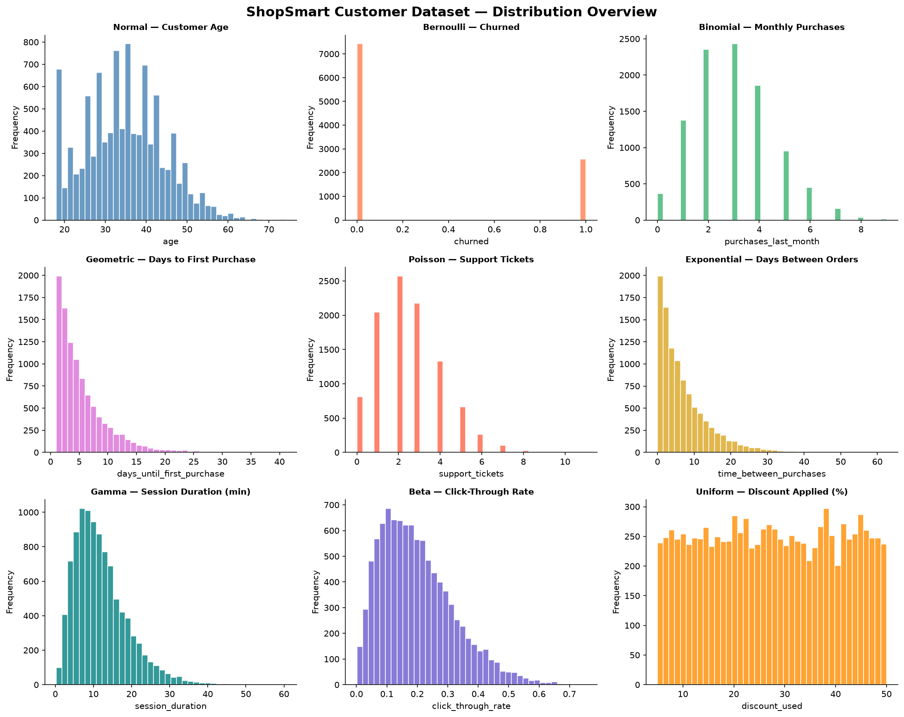
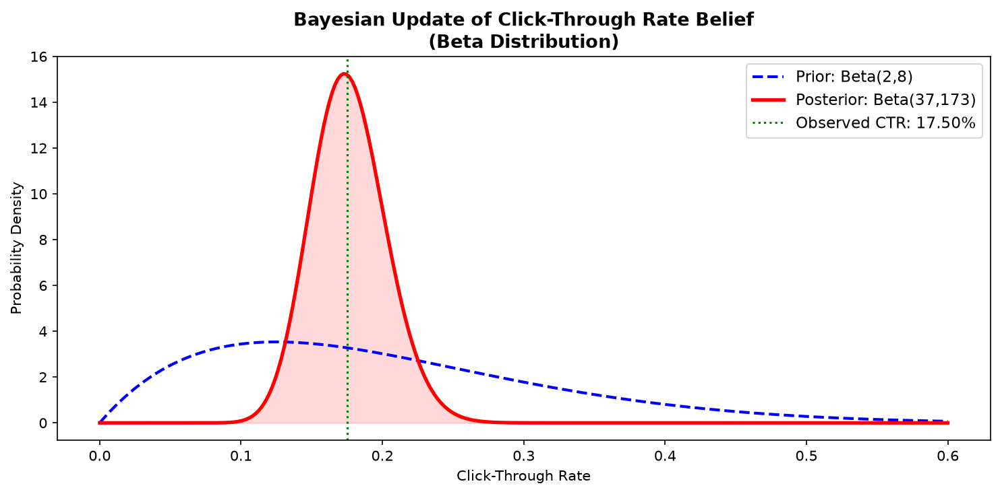
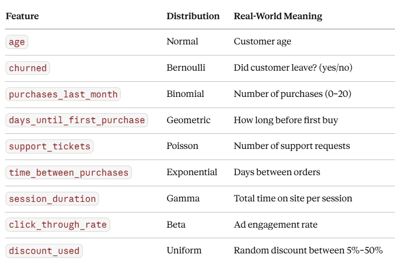
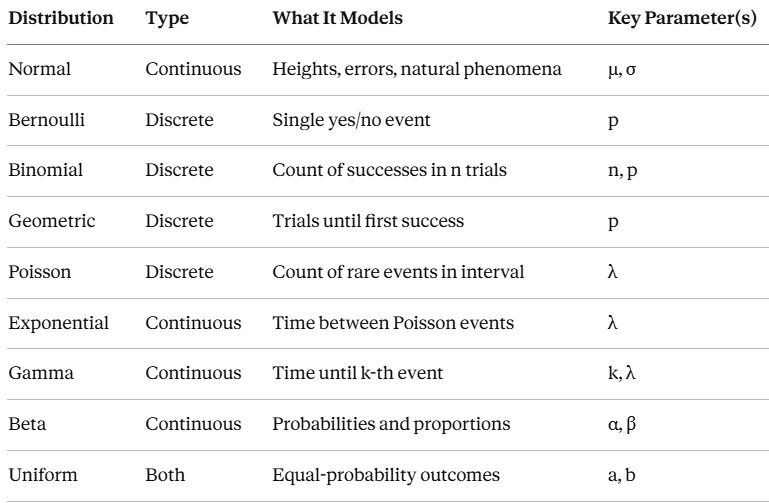
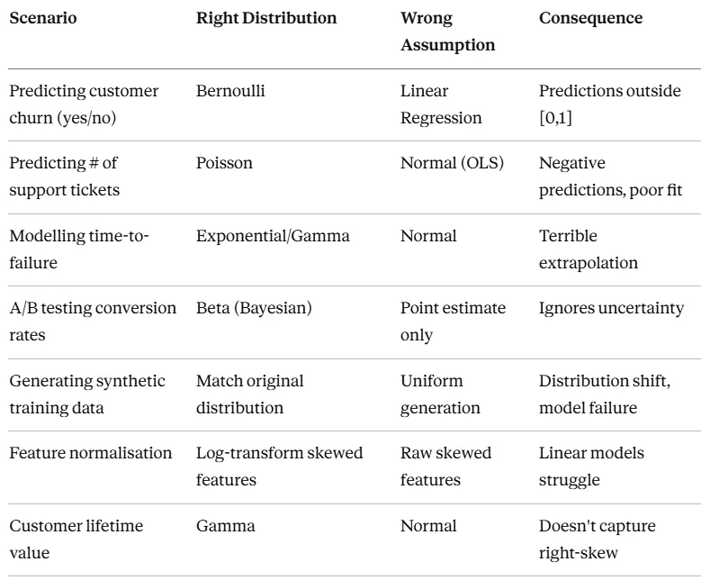

# Mastering Probability Distributions

A hands-on Python project that demonstrates **9 probability distributions** in a realistic business context — the fictional **ShopSmart** e-commerce customer dataset.

## Overview

This project walks through the full lifecycle of working with probability distributions: generating data, visualising it, testing fits, building ML models informed by distributional knowledge, performing Bayesian inference, and applying the right regression for count data.

## Steps

| Step | Function | Description |
|------|----------|-------------|
| **1** | `step1_generate_dataset()` | Generate a 5,000-row synthetic dataset using 9 distributions |
| **2** | `step2_visualise_distributions(df)` | Plot a 3×3 histogram grid of all features |
| **3** | `step3_fit_distributions(df)` | Fit Normal & Gamma distributions; run Kolmogorov–Smirnov tests |
| **4** | `step4_churn_prediction(df)` | Train Logistic Regression & Random Forest for churn prediction |
| **5** | `step5_bayesian_beta_update()` | Bayesian updating of click-through rate belief (Beta distribution) |
| **6** | `step6_poisson_regression(df)` | Compare Poisson GLM vs OLS for predicting support-ticket counts |

## Distributions Used

| # | Distribution | Feature | Parameters |
|---|-------------|---------|------------|
| 1 | **Normal** | Customer Age | μ=35, σ=10 |
| 2 | **Bernoulli** | Churned (yes/no) | p=0.25 |
| 3 | **Binomial** | Purchases Last Month | n=20, p=0.15 |
| 4 | **Geometric** | Days Until First Purchase | p=0.2 |
| 5 | **Poisson** | Support Tickets Filed | λ=2.5 |
| 6 | **Exponential** | Days Between Purchases | scale=7 |
| 7 | **Gamma** | Session Duration (min) | shape=3, scale=4 |
| 8 | **Beta** | Click-Through Rate | α=2, β=8 |
| 9 | **Uniform** | Discount Applied (%) | low=5, high=50 |

## Sample Output

### Distribution Overview (Step 2)



### Bayesian Beta Update (Step 5)



## Requirements

- Python ≥ 3.14
- Dependencies (managed via `uv`):

| Package | Version |
|---------|---------|
| matplotlib | ≥ 3.11.0 |
| pandas | ≥ 3.0.3 |
| scikit-learn | ≥ 1.9.0 |
| scipy | ≥ 1.18.0 |
| seaborn | ≥ 0.13.2 |
| statsmodels | ≥ 0.14.6 |

## Getting Started

```bash
# Clone the repository
git clone <repo-url>
cd mastering-probability-distributions

# Set up the virtual environment with uv
uv sync

# Run the full walkthrough
uv run python main.py
```

## Project Structure

```
mastering-probability-distributions/
├── main.py                      # All 6 steps + main() entry point
├── pyproject.toml               # Project metadata & dependencies
├── uv.lock                      # Locked dependency versions
├── shopsmart_distributions.png  # Generated: 3×3 histogram grid
├── bayesian_beta_update.png     # Generated: prior → posterior plot
└── README.md
```



